# MyFirstMVC
This repository contains a my first MVC as well as publication to Azure

## Context
This is a basic Web App using ASP.NET application that includes publication to Azure

## Table of Contents
- [MyFirstMVC](#myfirstmvc)
- [Context](#context)
- [Table of Contents](#table-of-contents)

## Overview
Web App using ASP.NET  
Imagine, You’re the owner of a startup organization that facilitates the sale of comics online around your area. To get your product to market as quickly as possible, you decided to use Microsoft Azure App Service to host your web apps and APIs. The following tasks need to be completed:

### Task 1: Create a web app using ASP.NET In the Azure portal and deploy the web application to Web Apps- Using the information below:  
- Home page – which must show all other tabs such as Location, Favourites, About Us, and Latest News  
- All of your pages must have a footer with your name, student number, and the course you are enrolled in.  
Screenshot of the Output: 
    

Location Page  
This page displays the geographic location of Comic bookstores in an area around you. Use Geolocation to add a Google Map with a Marker to Your Website a minimum of 5 comic book stores are required on your map.  
Screenshot of the Output:
    

Other Pages  
1. Favorites: This page should display 4 of your favorite comics with a brief 
explanation. Use your design for the look and feel of the page. This information 
should be displayed once the Favorite button is clicked. 
Screenshot of the Output:
    
   

2. About us: Include a brief explanation of your comic business. This information 
should be displayed once the About Us button is clicked.  
Screenshot of the Output:
    

3. Latest News: Link the website to an external page to show information on the 
new comic’s release. This information should be displayed once the Latest News 
button is clicked.  
Screenshot of the Output: 
    
   
   

When you click on one of the ‘Learn More’ buttons, it will redirect you to an external page:
    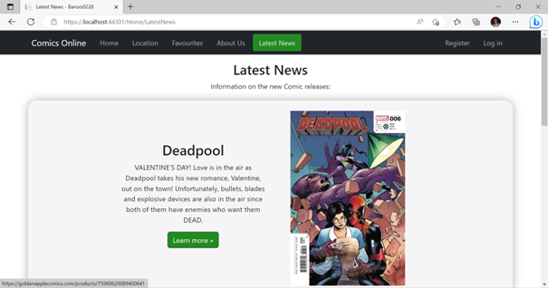

Like this:
    

Publishing to Azure: Using Microsoft Azure App Service to host your web apps and APIs. 
The steps and screenshots of the steps: 
As we can see, the web application is currently running on our ‘localhost’: 
    

1.1. So in order to host our Web Application in Microsoft Azure, the first thing 
would be to open up Visual Studio and open our Web Application MVC. 
    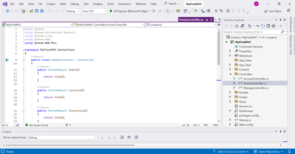

1.2. Right click on the MVC Application: 
    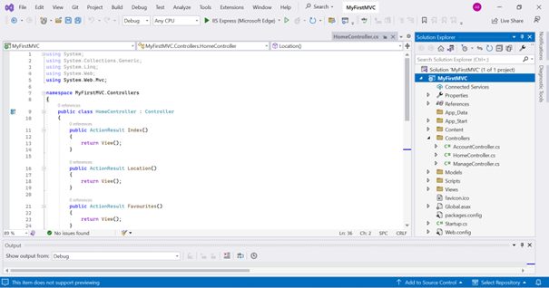

1.3. Click on ‘Publish…’: 
    

1.4. Select ‘Azure’ and click ‘Next’: 
    

1.5. Select ‘Azure App Service (Windows)’ and click ‘Next’: 
    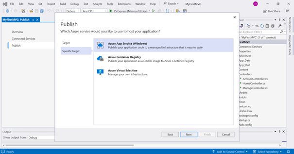

1.6. Choose the account to which you want to publish the Web Application to and if there is no Azure App Service already created, click on ‘+ Create new’: 
    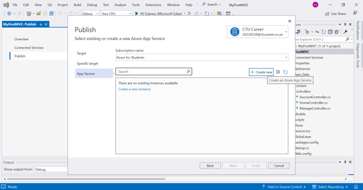

1.7. This is the window that creates the App Service in Azure. You can provide a name; and the resource group and hosting plan is created automatically. Then 
click ‘Create’: 
    

1.8. The App Service is now being created: 
    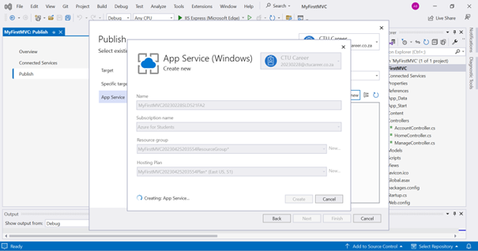

1.9. Once the App Service has been created successfully click ‘Finish’: 
    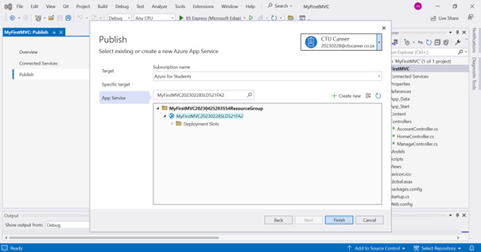

1.10. The Publish Profile has also been created successfully. Click ‘Close’: 
    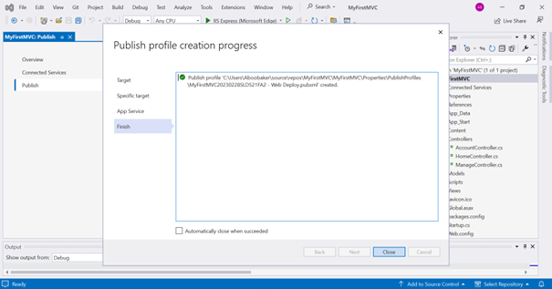

2.1. The Web Application MVC is now ready to publish. Click on ‘Publish’: 
    

2.2. The Web Application is now being published to Azure App Service: 
    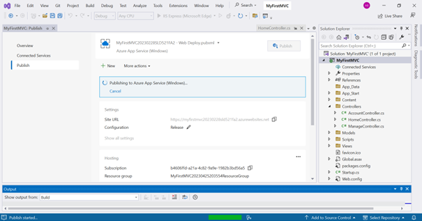

2.3. Once the Web Application has been published successfully, you can Copy the Link/Site URL to the clipboard: 
    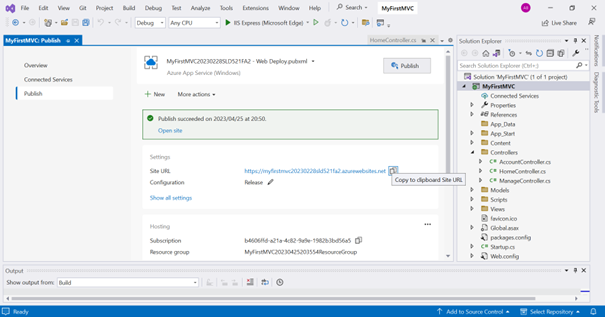

2.4. Paste the Link/Site URL in the URL of your browser and hit ‘Enter’: 
    

2.5. The Web Application has now been hosted successfully on Azure Web App Service and is live. The Web Application is no longer running on the ‘localhost’: 
    

3.1. Now sign in to your Azure Portal:
    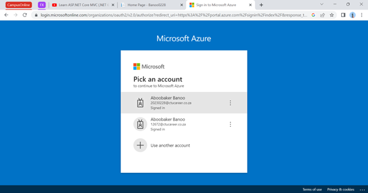

3.2. Click on ‘Resource Groups’: 
    

3.3. This is the Resource Group that contains the Web Application that we just published: 
    

3.4. Now on the top right-hand corner, click on the Cloud Shell icon. Once the Cloud Shell has opened up, type in this command: 
`Remove-AzResourceGroup -Name {name of the resource group}`: 
    

3.5. Type ‘Y’ to confirm removing/deleting the Resource Group then hit ‘Enter’: 
    

3.6. The Resource Group has now been removed/deleted successfully: 
    

3.8. You can also refresh the ‘Resource Groups’ page to confirm that the Resource Group has been removed/deleted successfully: 
    

4.1. Finally, you can click the ‘x’ icon to close all the active applications: 
    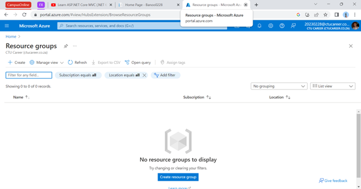