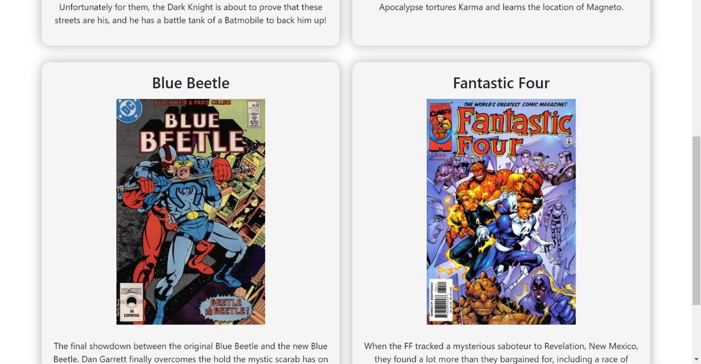
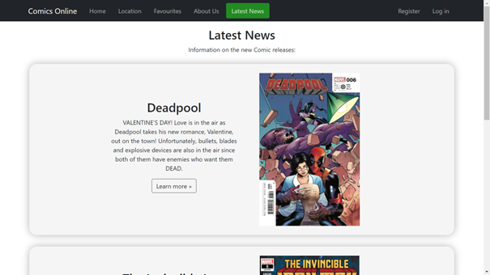
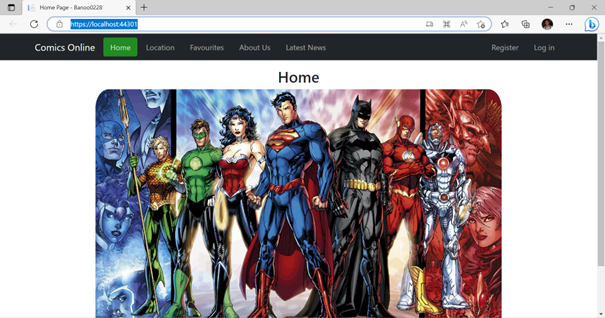
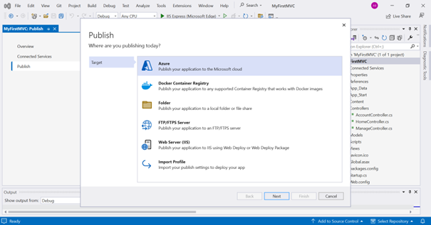

# MyFirstMVC
This repository contains my first MVC web application and its deployment to Azure.


## Context
This project is a basic web app developed using ASP.NET MVC and deployed to Microsoft Azure App Service. It showcases a simple web solution for a comic book startup.


## Table of Contents
- [MyFirstMVC](#myfirstmvc)
- [Context](#context)
- [Table of Contents](#table-of-contents)
- [Overview](#overview)
- [Features](#features)
    - [Home Page](#home-page)
    - [Location Page](#location-page)
    - [Favorites Page](#favorites-page)
    - [About Us Page](#about-us-page)
    - [Latest News Page](#latest-news-page)
- [Deployment to Azure](#deployment-to-azure) 
    - [Preparation](#preparation)
    - [Steps for Deployment](#steps-for-deployment)
- [Deleting Azure Resources](#deleting-azure-resources)


## Overview
The web app facilitates the sale of comics online in your area. Using Microsoft Azure App Service, this app provides an accessible and scalable solution for hosting. The following tasks were completed:  
- Development of a web app with multiple pages.  
- Deployment of the web app to Azure.  
- Cleanup of Azure resources. 


## Features
### Home Page
- The home page links to other sections: **Location**, **Favorites**, **About Us**, and **Latest News**.  
- Includes a footer with your name, student number, and course information.
<br> Screenshot:
<br> 


### Location Page
- Displays the geographic locations of at least 5 nearby comic bookstores.
- Integrated with Google Maps, showing store locations with markers.
<br> Screenshot:
<br> 


### Favorites Page
- Displays your four favorite comics with descriptions.
- Information is revealed upon clicking the **Favorites** button.
<br> Screenshots:
<br> 
<br> 
<br> 


### About Us Page
- A brief description of the comic business.
- Content appears when the **About Us** button is clicked.
<br> Screenshot:
<br> 


### Latest News Page
- Links to external pages showing new comic releases.
<br> Screenshots: <br> 


- Content appears when the **Learn More** button is clicked.
<br> Screenshot:
<br> 


## Deployment to Azure

### Preparation
Before deploying, ensure the web app runs locally:
<br> Screenshot:
<br> 


### Steps for Deployment
1. **Publish from Visual Studio**
   - Right-click the project and select **Publish**.
   <br> Screenshot:
   <br> 


2. **Choose Azure**
   - Select **Azure App Service (Windows)** and log in.
   <br> Screenshot:
   


3. **Create App Service**
   - Provide a name and let Azure set up the hosting environment.
   <br> Screenshot:
   <br> 


4. **Publish the App**
   - Click **Publish** to deploy the web app to Azure.
   <br> Screenshot:
   <br> 


5. **Access the App**
   - Use the Azure-generated URL to view your live web app.
   <br> Screenshot:
   <br> 


6. **Success**
   - Hosted live web app.
   <br> Screenshot:
   <br> 


## Deleting Azure Resources

1. **Log in to Azure Portal**
   Navigate to the **Resource Groups** section.
   <br> Screenshot:
   <br> 


2. **Identify the Resource Group**
   Locate the resource group containing your deployed web application.
   <br> Screenshot:
   <br> 


3. **Open Cloud Shell**
   - Click on the **Cloud Shell** icon in the top-right corner of the Azure Portal.
   - Once the shell opens, select the **PowerShell** environment.
   <br> Screenshot:
   <br> 


4. **Run the Deletion Command**
   - Use the following command to remove the resource group:
   ```powershell
   Remove-AzResourceGroup -Name {ResourceGroupName}
   ```
   - Replace `{ResourceGroupName}` with the actual name of the resource group you want to delete.
   <br> Screenshot:
   <br> 


4. **Confirm Deletion**
    - Type `Y` to confirm the deletion when prompted and press `Enter`.
    - Wait for Azure to remove all associated resources.
    <br> Screenshot:
    <br> 


5. **Verify Resource Deletion**
    - Refresh the **Resource Groups** page to ensure the group has been deleted.
    <br> Screenshot:
    <br> 